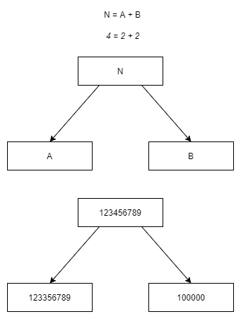

# Foregone Solution

[Link](https://codingcompetitions.withgoogle.com/codejam/round/0000000000051705/0000000000088231)

## Solution

My idea was that we need to care only with character/digit 4. 
That character doesn't influence the other characters. 

We store two part of the result. 
The first one is almost the same as the original number, it has character 3 instead of 4. 
The second part has character 1 where the original has 4, and zero elsewhere. 
This way we changed 4 to 3 + 1.

### Complexity

Let l be length of the input. 
Then, the complexity is O(l), because we have to go through all character in the input, but we need to do it only once.

## Experience

+ This problem was easy to test, and testing proved to be useful. However, there are more good solutions to the problem, the outputs were obvious considering the algorithm.
+ The extra test case may had huge numbers 1 < N < 10^100. So integer was not sufficient. Either BigInteger, or a String was a good solution.